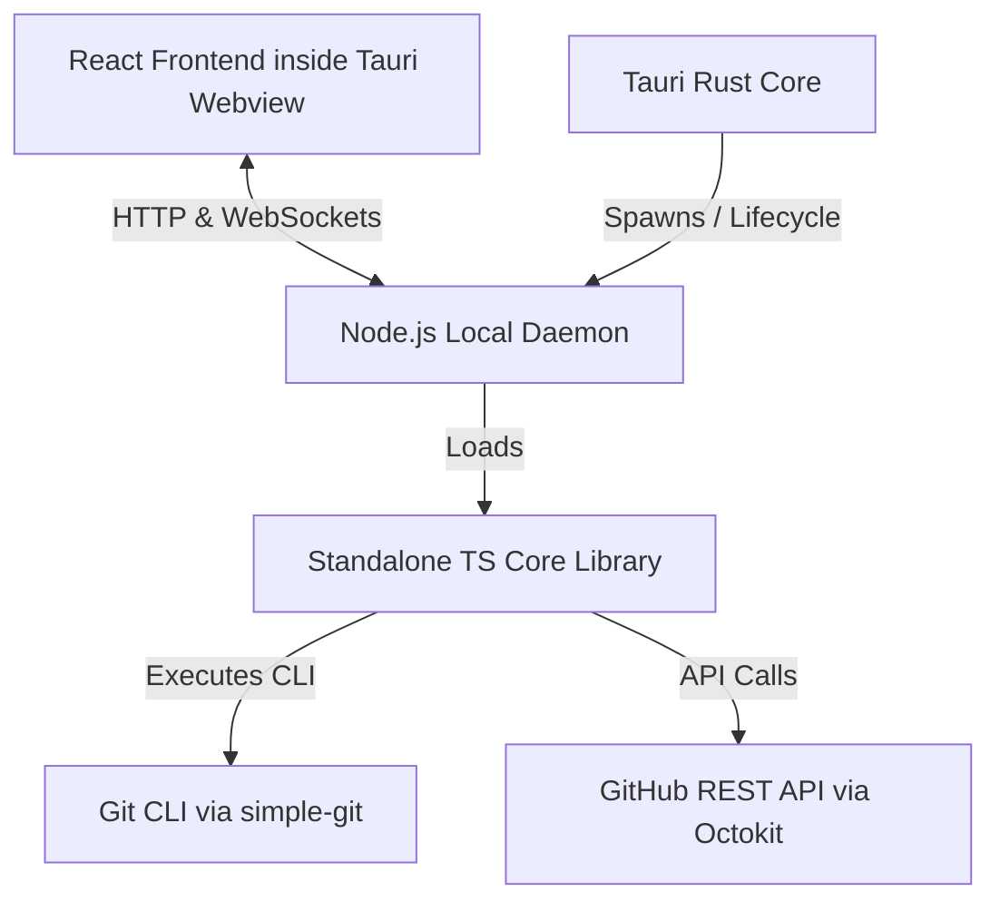
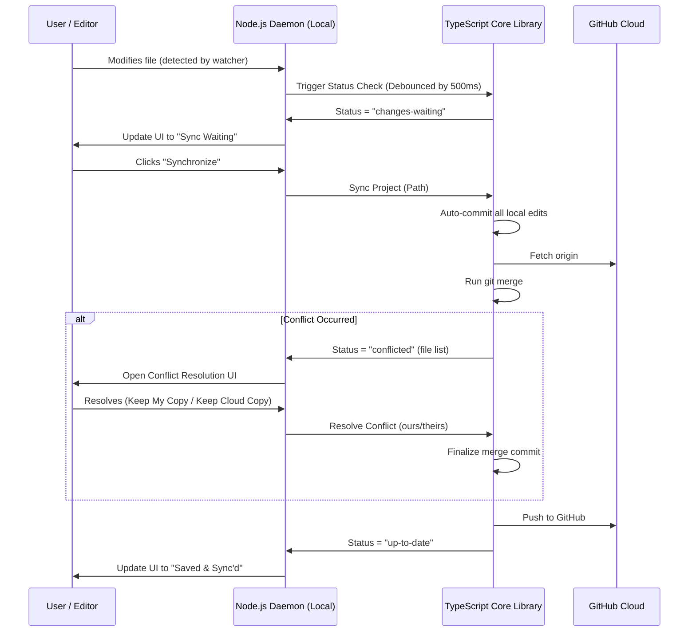

# Dev Dropbox 📦

**Dev Dropbox** is a production-quality, open-source desktop application designed to make Git invisible. It transforms standard Git repositories into a seamless, auto-syncing folder experience—just like Dropbox. 

Dev Dropbox is built for developers who want to avoid the friction of the CLI, students learning to code, and kids who want to collaborate on coding projects without dealing with merge issues, commit logs, or SSH setups.

---

## 🌟 Features

*   **Invisible Git Integration**: No terminals, no branches, and no commit messages to write. Dev Dropbox speaks simple language like *"Changes waiting to sync"* and *"Up to date"*.
*   **First-Run Setup Wizard**: A friendly wizard that configures GitHub authentication tokens or SSH keys in seconds.
*   **Safety First (Non-Destructive)**: Never runs force pushes or hard checkouts. Every local file modification is auto-saved in local commits, and remote updates are pulled via standard merges.
*   **Conflict Resolution Engine**: When files diverge, it presents a simple window explaining the issue and lets the user click **"Keep My Copy"** or **"Keep Cloud Copy"**.
*   **Project Validation**:
    *   Blocks tracking of system roots and home folders.
    *   Warns about oversized directories (>10,000 files or >500MB).
    *   Detects nested repositories to avoid conflicts.
    *   Auto-detects project languages (Node.js, Python, Rust) and writes clean `.gitignore` files automatically.
*   **System Tray Integration**: Runs silently in the background, syncing files in real-time as you write code.

---

## 📐 Architecture

Dev Dropbox operates on a **Three-Tier Architecture** to separate UI elements from systems/filesystem execution:



### Flow of a Sync Cycle


---

## 🖥️ macOS Installation Guide

Follow these steps to install and run Dev Dropbox on macOS.

### 📋 Prerequisites
Make sure your Mac has **Homebrew**, **Git**, and **Node.js** installed. If not, open the Terminal and run:
```bash
# 1. Install Homebrew (if you don't have it)
/bin/bash -c "$(curl -fsSL https://raw.githubusercontent.com/Homebrew/install/HEAD/install.sh)"

# 2. Install Git and Node.js
brew install git node
```

### 🚀 Step-by-Step Install

1.  **Clone the Repository**:
    ```bash
    git clone https://github.com/YugTheMaker/dev-dropbox.git
    cd dev-dropbox
    ```

2.  **Install Monorepo Dependencies**:
    ```bash
    npm install
    ```

3.  **Compile TypeScript Packages**:
    ```bash
    npm run build:core
    ```

4.  **Run Dev Environment**:
    ```bash
    npm run dev
    ```
    This launches the backend daemon on port 36911 and compiles/opens the desktop application in a Tauri native macOS window.

5.  **Build a Production Package**:
    ```bash
    npm run build
    ```
    The compiled macOS application bundle (`.app` or `.dmg`) will be placed in `src-tauri/target/release/bundle/`.

    > [!TIP]
    > **macOS Gatekeeper Warning**: Locally compiled bundles that are not officially code-signed will show a "damaged and can't be opened" alert on macOS. You can bypass this flag on your local machine by running:
    > ```bash
    > xattr -cr src-tauri/target/release/bundle/macos/dev-dropbox.app
    > ```
    > If you are publishing/sharing the app with others, make sure to configure GitHub Actions secrets for macOS Code Signing and Notarization.

---

## 🛠️ Tech Stack
*   **Desktop Shell**: [Tauri v2](https://tauri.app/) (Rust)
*   **UI Layer**: React, TypeScript, Vite, Tailwind CSS
*   **Git Automation**: Node.js `simple-git`
*   **Cloud API Client**: `@octokit/rest` (GitHub)
*   **File System Watcher**: `chokidar`

---

## 🤝 Contributing
Please see [CONTRIBUTING.md](CONTRIBUTING.md) for contribution guidelines, project layout details, and instruction on adding new cloud providers.

## ✍️ Creator & Author

Dev Dropbox is designed, developed, and maintained with passion by **Yug Sisodiya** ([@YugTheMaker](https://github.com/YugTheMaker)), a 10-year-old kid and developer from India. Yug loves building creative software tools, coding projects, and making technology simpler and more accessible for everyone. 

*   🖥️ **GitHub**: [@YugTheMaker](https://github.com/YugTheMaker)
*   🚀 **Mission**: Building tools that make coding accessible and fun for kids and developers alike!


## 📄 License
Dev Dropbox is open-source software licensed under the MIT License.